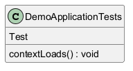

# Generated Documentation with UML
# Documentation for `DemoApplicationTests.contextLoads()`

## Overview
This documentation covers the `contextLoads()` function from the `DemoApplicationTests` class. This function forms part of a broader testing framework designed to ensure that the application context loads correctly in a Spring-based application. Below, we will outline its purpose, operation, and the context within which it operates, along with its dependencies.

## Function: `DemoApplicationTests.contextLoads()`

### Purpose
The `contextLoads()` function serves as a fundamental test case in the `DemoApplicationTests` class. Its primary purpose is to verify that the Spring application context is initialized successfully. A successful context load is crucial for the application, as it indicates that all beans and configurations have been set up correctly and are ready for interaction.

### Body
The body of the `contextLoads()` function is currently empty:

```java
{
}
```

### Dependencies
The function has a dependency on `func1`. However, as no specific details about `func1` are provided in the original information, we can only provide a generalized idea about dependencies.

### How it Works
1. **Testing Framework Integration**: The function is annotated as a test case (most likely using JUnit or a similar testing framework). When tests are executed, this function will run as part of the overall test suite.
   
2. **Context Initialization**: When the `contextLoads()` method is called, the Spring testing framework will automatically try to load the application context. This involves scanning for components, configurations, and services defined in your Spring application.

3. **Assertion**: Although there's no explicit body in the current implementation, typically a context load test will include assertions that check whether specific beans exist or whether the application can respond correctly. The lack of assertions may suggest that this test is intended to run without specific checks, primarily focusing on loading without exceptions.

4. **Outcome**: If the context loads successfully without throwing any exceptions, the test will pass, indicating that the application is correctly configured. Conversely, if the application context fails to load, an error will be raised, pinpointing a misconfiguration or missing dependencies in the Spring application.

### Business Logic
The successful initialization of the application context is critical for any Spring-based applications. It ensures that all the necessary components for the application are available and ready to handle user requests. Ideally, this function should be part of a larger suite of tests that also check the functionality of individual components (services, repositories, controllers) to ensure comprehensive application stability and performance.

In terms of business logic:
- It allows the development team to confidently make changes or additions to the codebase, ensuring that even with new changes, the core application setup remains intact.
- It serves as a safety net during the development lifecycle, helping developers identify issues early on before they escalate into more significant bugs in production.

Overall, `contextLoads()` plays a crucial role in any Spring application testing framework by establishing a baseline of the health and viability of the application context.
## UML Diagram


