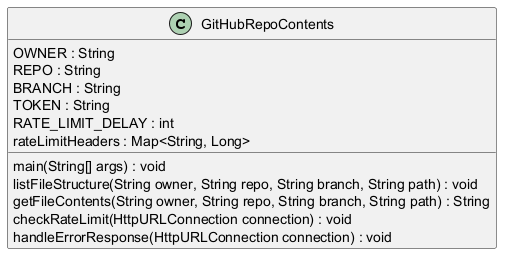

# Detailed Documentation for GitHubRepoContents Functions

The following documentation outlines the functionality of each function within the `GitHubRepoContents` class. The functions are designed to interact with the GitHub API to retrieve file contents and structure from a repository. Each function follows a specific purpose and executes in a sequence that ensures proper handling of API requests, responses, and any errors that may arise. The functions are referred to by their shorthand (func1, func2, etc.) to maintain clarity in their interdependencies.

## Function Overview

### 1. `GitHubRepoContents.main(String[] args)`
**Shorthand: func1** 

#### Description
The entry point for the application, this function is responsible for executing the main logic of the program. It may initialize parameters and manage the flow of other functions to achieve the desired outcomes.

#### How it Works
- It currently has comments indicating where calls to other functions would normally occur, such as `listFileStructure` for displaying directory contents.
- It retrieves the contents of a specific file (`DemoApplication.java` in this example) by invoking the `getFileContents` function.
- It prints the parsed contents of the file using `SimpleJavaParser`.

#### Business Logic
This function encapsulates the overall execution of the program, serving as the starting point for file retrieval and potentially other operations related to the GitHub repository.

---

### 2. `GitHubRepoContents.getFileContents(String owner, String repo, String branch, String path)`
**Shorthand: func2**

#### Description
Fetches the contents of a specific file from a GitHub repository using the provided parameters for owner, repository, branch, and file path. It first constructs the appropriate API URL and sets up an HTTP connection.

#### How it Works
- Constructs the URL according to GitHub's API format to access the file’s content.
- Opens an HTTP connection and sets the request method to `GET`.
- Adds authentication and content type headers.
- Calls `checkRateLimit` to ensure that GitHub API rate limits are respected.
- Executes the connection and checks the response code:
  - If successful (response code 200), reads the content from the input stream.
  - If not, it calls `handleErrorResponse`.

#### Business Logic
This function is essential for retrieving the raw contents of files from GitHub. It manages API requests while providing error handling to ensure developers can efficiently access repository files.

---

### 3. `GitHubRepoContents.listFileStructure(String owner, String repo, String branch, String path)`
**Shorthand: func3**

#### Description
Examines the folder structure of a specified path within a GitHub repository, identifying files and subdirectories. It's a valuable feature for understanding how files are organized in a repo.

#### How it Works
- Similar to `getFileContents`, it constructs the appropriate URL for retrieving folder contents.
- Sets up the HTTP connection and headers.
- Calls `checkRateLimit` to ensure compliance with GitHub's rate limit policy.
- Processes a successful response:
  - Reads the input stream and converts it into a JSON array.
  - Iterates through the contents, identifying and printing the file and directory types.
  - Recursively calls itself if a directory is found, allowing for a depth-first traversal of the file structure.
- If the response fails, it invokes `handleErrorResponse`.

#### Business Logic
This function is designed to provide visibility into the structure of a repository, helping users navigate through files and understand their organization—important for developers working in collaborative environments.

---

### 4. `GitHubRepoContents.checkRateLimit(HttpURLConnection connection)`
**Shorthand: func4**

#### Description
Checks the API rate limit headers to determine if the request limit has been reached. If the limit is reached, it pauses execution to avoid hitting the limit and receiving error responses from GitHub.

#### How it Works
- It inspects the response headers from the API call.
- If the remaining requests are zero, it causes the current thread to sleep for a specified delay (`RATE_LIMIT_DELAY`) to allow the rate limit to reset.
  
#### Business Logic
This function is crucial for maintaining application stability and compliance with GitHub's API restrictions. It prevents unnecessary failures caused by excessive requests.

---

### 5. `GitHubRepoContents.handleErrorResponse(HttpURLConnection connection)`
**Shorthand: func5**

#### Description
Handles error responses from the GitHub API in the event that a request fails, providing meaningful feedback to developers by printing error details.

#### How it Works
- Retrieves the HTTP response code to notify the developer of the failure.
- Reads error details from the connection's error stream.
- Closes the connection to clean up resources.
- Outputs the error information to the console for debugging and correction purposes.

#### Business Logic
This function enhances user experience by making error diagnosis easier. Understanding the cause of a failure is integral for developers, especially when working with external APIs.

---

## Execution Flow
1. The `main` function (func1) initializes the program.
2. It calls `getFileContents` (func2) to retrieve specific file contents.
3. Throughout the execution of `getFileContents`, it checks for rate limits using `checkRateLimit` (func4).
4. If there are errors during API requests, `handleErrorResponse` (func5) is invoked to manage them appropriately.
5. The `listFileStructure` (func3) can be called within `main`, showing the recursive nature of exploring repositories.

This systematic flow ensures efficient interaction with the GitHub API while incorporating necessary error handling and response management strategies based on the defined methods.
## UML Diagram

