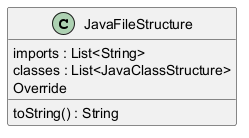

# Generated Documentation with UML
# Function Documentation

This documentation provides detailed explanations for the `JavaFileStructure.toString()` function. It describes how the function operates, its logic and structure, and its role in the overall system.

## Function: `JavaFileStructure.toString()`

### Description
The `toString` method of the `JavaFileStructure` class is designed to provide a comprehensive string representation of a Java file's structure. This representation includes all associated imports, classes, methods, fields, and their respective annotations. It formats this information in a plaintext format, making it easy to read and understand the hierarchy and components of the Java file.

### Dependencies
- The `toString()` function relies on various data structures and types, such as `imports`, `JavaClassStructure`, `JavaFieldStructure`, and `JavaMethodStructure`. These components must be populated prior to invoking this method to ensure accurate representation.

### Function Flow
1. **Initialization**:
   - A `StringBuilder` instance (`sb`) is created to construct the output string efficiently.

2. **Adding Imports**:
   - The method begins by appending "Imports:\n" to `sb`.
   - It iterates over the `imports` collection, appending each import statement prefixed with two spaces to align with the structure’s format, ending each statement with a newline.

3. **Processing Classes**:
   - The method then iterates over the collection of `JavaClassStructure` objects stored in the `classes` field.
   - For each class, it appends the class name prefixed with "Class:\n" and delays its processing until it has examined all relevant aspects.
  
4. **Adding Class Annotations**:
   - If the class has any annotations, it appends them neatly titled under "Annotations:" followed by the actual annotations.

5. **Adding Extended Classes**:
   - If the class extends any other class, it appends this information with a similar prefix for clarity.

6. **Adding Implemented Interfaces**:
   - For any interfaces implemented by the class, it appends that information as well.

7. **Adding Fields**:
   - The method indicates a transition to the fields section by appending "Fields:\n".
   - It iterates through each `JavaFieldStructure`, detailing the type and name of each field. If any field has annotations, it appends them in parentheses next to the field declaration.

8. **Adding Methods**:
   - The final section indicates the beginning of method definitions with "Methods:\n".
   - For each `JavaMethodStructure`, it appends the return type, method name, and its parameter list in standard format. 
   - If the method has annotations, these are appended below the method's signature under "Annotations:".
   - Additionally, it includes the method's body text for further context on implementation.

9. **Return the Result**:
   - Finally, the constructed string from `StringBuilder` is returned, containing a complete representation of the Java file's structure.

### Business Logic
The primary rationale behind this function is to facilitate easy visualization and review of a Java file's structure. It allows developers and other stakeholders to understand complex Java files at a glance, including the relationships between classes, fields, methods, and their metadata (annotations). This could be particularly useful for code reviews, documentation generation, and debugging processes. The method adheres to a systematic format that ensures consistency and readability, which is fundamental when dealing with large codebases where clarity is paramount. 

By generating a complete textual representation, this function also aids in meta-programming or tools that analyze or manipulate Java code, providing necessary insights into the code's architecture. 

Overall, the `JavaFileStructure.toString()` function serves as an essential utility for documenting and understanding Java file structures systematically.
## UML Diagram

