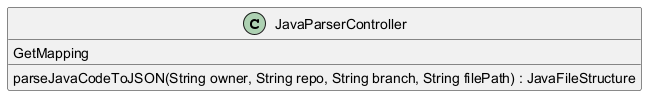

# Function Documentation for JavaParserController

This documentation provides a detailed explanation of the `JavaParserController.parseJavaCodeToJSON` function. Additionally, it outlines the dependencies and explains the underlying business logic.

## Function Overview

### `JavaParserController.parseJavaCodeToJSON`
```java
public JSONObject parseJavaCodeToJSON(String owner, String repo, String branch, String filePath)
```

#### Description
The `parseJavaCodeToJSON` function is designed to convert a Java source code file from a specified GitHub repository into a JSON representation. This function retrieves the file content from GitHub using the provided repository details, and then utilizes a parser to convert the code into a structured JSON format.

#### Parameters
- `owner`: A `String` representing the username or organization that owns the repository.
- `repo`: A `String` representing the name of the repository which contains the Java file.
- `branch`: A `String` indicating the branch of the repository from which to retrieve the file (e.g., `main` or `develop`).
- `filePath`: A `String` that specifies the path to the Java source file within the repository.

#### Returns
- A `JSONObject` that contains the parsed representation of the Java source code, structured in JSON format.

#### Execution Flow

1. **Initial Output of File Path Length**: The function begins by outputting the initial length of the `filePath` argument to the console. This is helpful during debugging to ensure that the path provided is correct.
   ```java
   System.out.println(filePath.length());
   ```

2. **Trimming Whitespace**: The function trims any leading or trailing whitespace from the `filePath` using the `trim()` method. This ensures that the path is clean and free from unintentional spaces that may affect the file retrieval.
   ```java
   filePath = filePath.trim();
   ```

3. **Output of Trimmed File Path Length**: After trimming, the length of the `filePath` is printed again to confirm the change. This can be useful for debugging purposes as it confirms the trimming step was successful.
   ```java
   System.out.println(filePath.length());
   ```

4. **Fetching File Contents from GitHub**: The function calls `GitHubRepoContents.getFileContents(owner, repo, branch, filePath)`. This method is responsible for querying the GitHub API to fetch the content of the specified file. The parameters passed are `owner`, `repo`, `branch`, and the trimmed `filePath`. This step represents a crucial part of the function as it connects to an external service to retrieve essential data.

5. **Parsing Java Code**: The resultant `fileContent` (which contains the raw Java code) is then passed to `SimpleJavaParser.parseJavaCode(fileContent)`. This step involves utilizing a Java parser that converts the source code into a structured format comprehensible in JSON, allowing further manipulation or analysis of the code. The output of this method is then returned by the `parseJavaCodeToJSON` function.
   ```java
   return SimpleJavaParser.parseJavaCode(fileContent);
   ```

6. **Returning the JSON Object**: Finally, the structured JSON object is returned to the caller, thus providing a machine-readable representation of the original Java code.

#### Business Logic
The primary motive behind the `parseJavaCodeToJSON` function is to facilitate the analysis and processing of Java code stored in GitHub repositories. By transforming source code into JSON, developers can easily integrate it into various applications, such as code analysis tools, format checkers, or documentation generators. This functionality is vital in environments where code needs to be programmatically interpreted, analyzed, or transformed for various development activities.

The process of fetching file contents and parsing it into JSON positions the function as a critical building block in software engineering tools and practices, such as continuous integration and deployment frameworks, static analysis tools, or educational platforms for teaching Java programming concepts.
## UML Diagram


