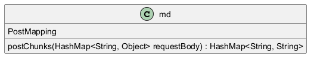

# Function Documentation

This documentation provides detailed explanations for each function in the specified order of execution based on their interdependencies. Each function contributes to manipulating or obtaining properties related to a `Cube` object.

---

## 1. Function `func1`: `createCube()`

### Description
This function is responsible for creating a new instance of the `Cube` class. It clones the current edge and corner states of the cube, ensuring that modifications to the new cube do not affect the original cube. This is essential for maintaining integrity in calculations or simulations involving multiple cube states.

### Body
```java
return new Cube(this.getEdge().clone(), this.getCorner().clone());
```

### Dependencies
- `getEdge()`: Must return the current edge state of the cube.
- `getCorner()`: Must return the current corner state of the cube.

---

## 2. Function `func2`: `applyMoves(Cube c, String s)`

### Description
This function takes a `Cube` object `c` and a string `s` that contains the sequence of moves to be applied to the cube. It processes move notations and updates the edge and corner positions and orientations according to predefined transformation maps. This function facilitates the modification of the cube's state based on user input or predetermined sequences, which is vital for solving algorithms or animations.

### Body
```java
Cube temp = c.clone();
String[] moves = s.split(" ");
if (moves.length > 1) {
    StringBuilder sBuilder = new StringBuilder();
    for (String string : moves) {
        // Process different move lengths.
        if (string.length() == 1)
            sBuilder.append(string.charAt(0));
        else if (string.charAt(1) == '2')
            sBuilder.append(String.valueOf(string.charAt(0)).repeat(2));
        else
            sBuilder.append(String.valueOf(string.charAt(0)).repeat(3));
    }
    s = sBuilder.toString();
}

for (int i = 0; i < s.length(); i++) {
    char ch = s.charAt(i);
    EdgePos edgePos = temp.getEdge().getEdgePos().clone();
    EdgeOrientation edgeOrientation = temp.getEdge().getEdgeOrientation().clone();
    // Update edge position and orientation.
    for (int j = 0; j < 12; j++) {
        edgeOrientation.setVal(j, nextEdgeOrientation.get(ch).get(edgePos.getVal()[j]).get(edgeOrientation.getVal()[j]));
        edgePos.setVal(j, nextEdgePos.get(ch).getVal()[edgePos.getVal()[j]]);
    }
    temp.setEdge(new Edge(edgePos, edgeOrientation));

    CornerPos cornerPos = temp.getCorner().getCornerPos().clone();
    CornerOrientation cornerOrientation = temp.getCorner().getCornerOrientation().clone();
    // Update corner position and orientation.
    for (int j = 0; j < 8; j++) {
        cornerOrientation.setVal(j, nextCornerOrientation.get(ch).get(cornerPos.getVal()[j]).get(cornerOrientation.getVal()[j]));
        cornerPos.setVal(j, nextCornerPos.get(ch).getVal()[cornerPos.getVal()[j]]);
    }
    temp.setCorner(new Corner(cornerPos, cornerOrientation));
}
return temp;
```

### Dependencies
- `getEdge()`, `getCorner()`, `setEdge()`, and `setCorner()` must be defined in the `Cube` class.
- The transformation maps: `nextEdgeOrientation`, `nextEdgePos`, `nextCornerOrientation`, and `nextCornerPos` must be pre-defined structures for valid operations on the cube.

---

## 3. Function `func3`: `repeatAndReverse(String s)`

### Description
This function takes a string `s`, repeats each character three times, and then returns the reversed result as a string. It employs `StringBuilder` for efficient string manipulation, maintaining performance during string changes. This may be useful for visualizing move notations or creating custom representations of cube states.

### Body
```java
StringBuilder result = new StringBuilder();
for (int i = 0; i < s.length(); i++)
    result.append(String.valueOf(s.charAt(i)).repeat(3));
return new StringBuilder(result.toString()).reverse().toString();
```

### Dependencies
- `StringBuilder`: This class is used for constructing strings efficiently and requires no external dependencies.

---

## 4. Function `func4`: `compressMoves(String moves)`

### Description
This function processes a series of move characters and compresses consecutive duplicates into a specific format (e.g., `R` becomes `R`, `RR` becomes `R2`), while ignoring sequences of three or more duplicates. This allows for a cleaner representation of move sequences, which is important in solving algorithms or when displaying the moves for users.

### Body
```java
class Temp {
    final char ch;  // character representing the move
    final byte b;   // count of repetitions

    public Temp(char ch, byte b) {
        this.ch = ch;
        this.b = b;
    }
}
Stack<Temp> s = new Stack<>();
ArrayList<String> v = new ArrayList<>(Arrays.asList("", "", "2", "'"));
ArrayList<String> result = new ArrayList<>();
for (int i = 0; i < moves.length(); i++) {
    // Logic to manage moves
    if (s.isEmpty() || s.peek().ch != moves.charAt(i))
        s.push(new Temp(moves.charAt(i), (byte) 1));
    else {
        Temp x = s.pop();
        // Increment count if not already 3
        if (x.b != (byte) 3)
            s.push(new Temp(x.ch, (byte) (x.b + 1)));
    }
}
while (!s.isEmpty()) {
    Temp x = s.pop();
    if (x.b != 0)
        result.add(0, x.ch + v.get(x.b));
}
return result;
```

### Dependencies
- Utilizes `Stack` and `ArrayList` for the necessary data structures, with no external dependencies required.

---

## 5. Function `func5`: `toString()`

### Description
This function provides a string representation of the `Cube` object, including its edge and corner states. It formats the output in a clear and structured string format, which is important for debugging, logging, or displaying the current state of the cube.

### Body
```java
return "Cube{\n" + "edge=" + edge.toString() + ",\ncorner=" + corner.toString() + "\n}";
```

### Dependencies
- Requires both the `edge` and `corner` objects to have a valid `toString()` method defined, allowing for their string representation.

---

## 6. Function `func6`: `getEdge()`

### Description
This function returns the current state of the `edge` variable. Typically, this refers to edges on a Rubik's Cube or a similar structure. It is crucial for operations that require knowledge of the edge states.

### Body
```java
return edge;
```

### Dependencies
- The variable `edge` must be defined and initialized prior to the function's call.

---

## 7. Function `func7`: `setEdge(Edge edge)`

### Description
This function sets the `edge` property of the current object. It allows for updates to the edges of the `Cube`. This is essential for modifying the cube's state and enabling adjustments to solver algorithms.

### Body
```java
this.edge = edge;
```

### Dependencies
- The `edge` parameter must be provided when calling this function, typically representing the new edge state.

---

## 8. Function `func8`: `getCorner()`

### Description
This function returns the current state of the `corner` variable. This typically pertains to corners of a structure like a Rubik's Cube. Similar to `getEdge()`, it is important for understanding the cube's configuration.

### Body
```java
return corner;
```

### Dependencies
- The variable `corner` must be defined and initialized prior to the function's call.

---

## 9. Function `func9`: `setCorner(Corner corner)`

### Description
This function sets the `corner` property of the current object. It allows for updates to the corners of the `Cube`. Just like `setEdge()`, this function is crucial for modifying the cube's state during operations.

### Body
```java
this.corner = corner;
```

### Dependencies
- The `corner` parameter must be provided when calling this function, typically representing the new corner state.

---

This documentation encapsulates an overview of function purposes, flows, and dependencies necessary for a comprehensive understanding of how to manipulate cube objects. Each function contributes to managing the properties and behaviors associated with cube configurations, enabling essential operations in applications like a Rubik's Cube solver or simulator.
## UML Diagram


